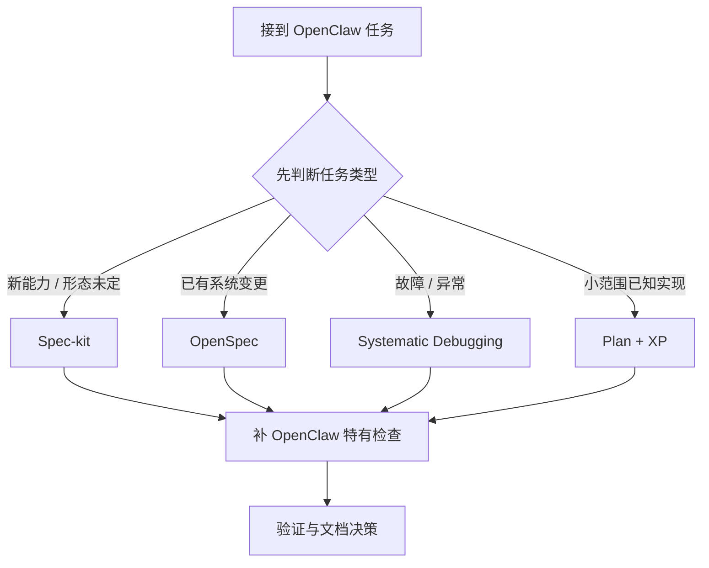
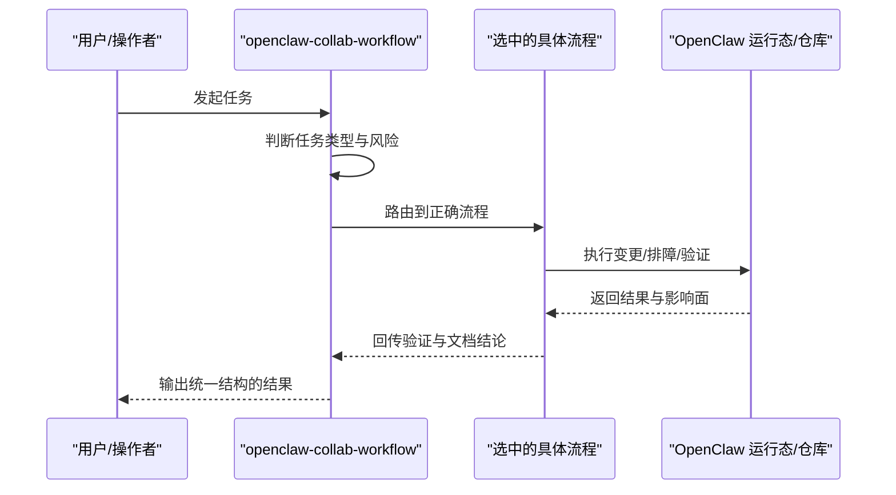

# OpenClaw 协作流程 Skill 中文释义

## 它能做什么

`openclaw-collab-workflow` 是一个仓库级协作路由 skill。

它的作用不是直接替代 Spec-kit、OpenSpec、调试、计划、实现或验收这些方法，而是先帮 OpenClaw 判断：当前这件事到底该走哪条流程，再补上这个仓库特有的安全、运行时和文档检查。

适合处理的典型问题包括：

- 多 Agent 协作与边界调整
- Feishu 多账号、群路由、allowlist
- ACP / Codex runtime 相关问题
- bootstrap、workspace sync、项目 Agent 初始化
- 安全规则、运维文档、跨 Agent 约束

## 为什么需要它

OpenClaw 的复杂度，不只在代码本身。

它同时包含：

- 多 Agent
- 多账号 Feishu
- ACP 本地补丁与升级兼容
- workspace 同步与项目 bootstrap
- 安全公约与高危操作约束
- operator 文档与 agent 文档分层

这类系统里，最常见的问题不是“不会写代码”，而是：

- 选错流程
- 误把现有系统改造当成新功能设计
- 误把故障排查当成直接改配置
- 忽略运行时、副作用、升级兼容和文档影响

这个 skill 的价值，就是在动手前先做一次正确分流，减少错误路径。

## 它的价值

对 OpenClaw 来说，这个 skill 的核心价值有三点：

1. **减少误操作**  
先判断任务类型，再进入正确流程，避免直接跳到实现。

2. **统一协作口径**  
无论是谁接手任务，先看同一套路由规则，减少“每个人各走各的”。

3. **把仓库特有风险前置**  
Feishu、ACP、bootstrap、安全边界这类 OpenClaw 特有问题，不再依赖临场记忆。

## 直观理解

下面这张图可以把它理解成一个“协作入口路由器”：

也可以把它看成一层保护网：

## 一句话总结

它不是“多一个流程”，而是让 OpenClaw 在复杂任务下，先走对路，再开始做事。
