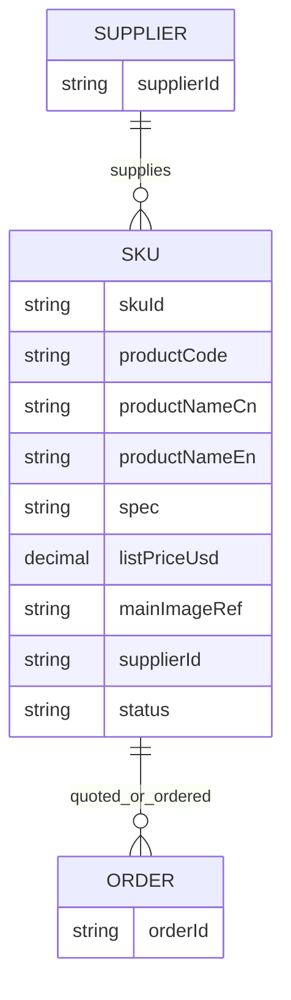

# 外贸轻系统最小业务模型

## 目标

先支撑太白做 4 件事：

1. 选品与比价
2. 生成报价单 Excel
3. 导出 PDF 对外发送
4. 跟踪订单

## 建模原则

- 先小后大
- 先保证报价链路跑通
- 先围绕 `SKU -> 报价 -> 订单`
- 供应商与订单先保留最小主键

## 实体

### 1. SKU

SKU 是核心主数据。

最小字段：

- `skuId`
- `productCode`
- `productNameCn`
- `productNameEn`
- `spec`
- `listPriceUsd`
- `mainImageRef`
- `supplierId`
- `status`

字段说明：

- `skuId`：系统唯一主键
- `productCode`：业务编码，可与现有型号一致，如 `VS8191`
- `productNameCn`：中文名
- `productNameEn`：英文名
- `spec`：核心规格，先合并存一段文本
- `listPriceUsd`：刊例价
- `mainImageRef`：主图链接或文件 ID
- `supplierId`：供应商主键
- `status`：`draft | active | archived`

### 2. Supplier

当前只保留：

- `supplierId`

### 3. Order

当前只保留：

- `orderId`

## SKU ID 方案

如果现阶段没有稳定唯一 ID，建议：

`SKU-{productCode}-{version}`

示例：

- `SKU-VS8191-01`
- `SKU-VS8191A-01`
- `SKU-VS0207-01`

规则：

1. `productCode` 取现有业务型号
2. 同一型号首次建档，`version=01`
3. 只有主数据发生结构性变化时才升版
4. 价格变动不改 `skuId`

这样做的目的：

- 保留人能读懂的型号
- 避免不同工厂、不同版本混淆
- 后面可平滑扩展多版本

## 与报价单模板的映射

当前 Excel 模板的最小映射关系：

- `productCode + productNameEn + spec` -> 报价单 `DESCRIPTIONS`
- `mainImageRef` -> 报价单 `PHOTO`
- `listPriceUsd` -> 报价单单价列
- `skuId` -> 内部引用，不一定对外展示
- `supplierId` -> 内部追踪，不一定对外展示

## 最小关系

## 数据落地建议

第一阶段只建 3 张表：

1. `SKU表`
2. `供应商表`
3. `订单表`

推荐放在飞书多维表格。

## 太白的使用逻辑

1. 用户给出客户和待报价 SKU
2. 太白查 `SKU表`
3. 拉取名称、规格、刊例价、主图
4. 填入报价 Excel 模板
5. 生成人工可复核的 Excel
6. 导出 PDF 并发送

## 暂不建模的内容

先不拆：

- 多币种报价
- 阶梯价
- 多供应商比价
- 包装明细子表
- 证书与素材多附件
- 订单状态流转

这些等报价链路稳定后再加。
